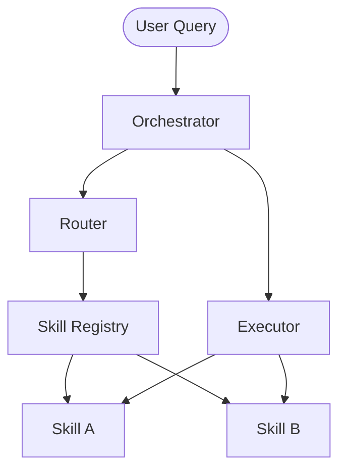

# 🚀 SkillOS

**SkillOS** is a powerful AI task orchestration framework designed to bridge the gap between Large Language Models and real-world execution. It provides a structured environment for building, composing, and governing AI skills that interact with external tools and APIs.

[](https://github.com/AlexeyPevz/SkillOS/actions/workflows/tests.yml)
[](https://opensource.org/licenses/MIT)

---

## ✨ Key Features

- **🧩 Modular Skills**: Define atomic actions with clear input/output schemas.
- **🔗 Extensible Connectors**: Bind skills to HTTP APIs, Databases, or Python functions.
- **🏗️ Skill Composition**: Chain skills into complex pipelines or parallel execution groups.
- **🛡️ Governance & Safety**: Built-in approval gates, budget controls, and role-based access (RBAC).
- **⚡ High Performance**: Async-first architecture with caching and circuit breakers.
- **🛰️ Webhook Integration**: Handle incoming events with signature verification and idempotency.

---

## 🏗️ Architecture

SkillOS follows a kernel-based architecture:

1. **Orchestrator**: The central brain that receives queries and plans execution.
2. **Registry**: Manages the catalog of available Skills and Connectors.
3. **Router**: Uses semantic matching to find the best skill for a user's intent.
4. **Executor**: Handles the safe execution of skills, managing state and recovery.



---

## 🚀 Quick Start

### Prerequisites

- Python 3.11+
- [Poetry](https://python-poetry.org/docs/#installation)

### Installation

1. Clone the repository:

   ```bash
   git clone https://github.com/AlexeyPevz/SkillOS.git
   cd SkillOS
   ```

2. Install dependencies:

   ```bash
   poetry install
   ```

### Running your first skill

Run a dry-run query to see which skill would be triggered:

```bash
poetry run skillos run "Find flights to Sochi" --root ./skills
```

---

## 🛠️ CLI Reference

SkillOS comes with a powerful CLI for development and operations.

| Command | Description |
| :--- | :--- |
| `skillos add-skill` | Scaffold a new skill directory |
| `skillos run` | Execute a query or a specific skill |
| `skillos compose-skill` | Build a multi-step skill |
| `skillos register` | Register existing skills to the registry |
| `skillos metrics` | View performance and execution metrics |

---

## 🌐 API Reference

Start the API server:

```bash
poetry run uvicorn skillos.api:app --host 0.0.0.0 --port 8000
```

- `GET /health` - System status.
- `POST /run` - Execute an AI query via HTTP.
- `POST /validate` - Verify skill integrity.

---

## ⚙️ Configuration

SkillOS is configured via environment variables or a `.env` file. See `.env.example` for a full list of options, including database (PostgreSQL) and Redis setup.

---

## 📄 License

This project is licensed under the MIT License - see the [LICENSE](LICENSE) file for details.
