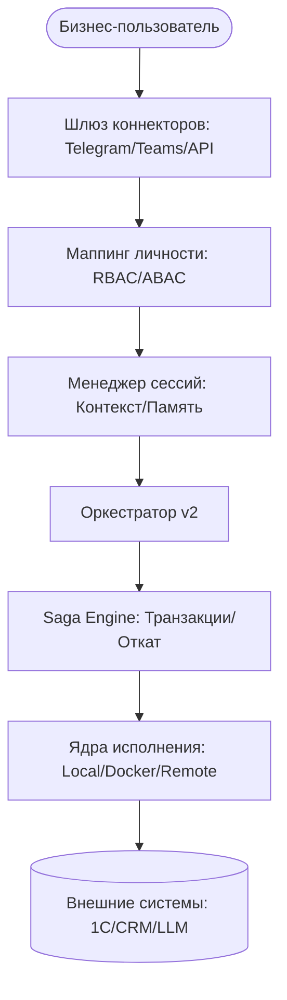

# SkillOS v2: Мастер-предложение по архитектуре

## 1. Видение и Стратегия

SkillOS v2 стремится эволюционировать из простого "Оркестратора навыков" в **Надежного автономного бизнес-оператора**. В то время как Clawdbot фокусируется на личной продуктивности, SkillOS v2 делает упор на **надежность корпоративного уровня**, **транзакционную безопасность** и **глубокую интеграцию** в российскую бизнес-экосистему (1С и др.).

### Высокоуровневая архитектура



---

## 2. Менеджер сессий и контекста (Корпоративная память)

Для устранения "амнезии агента" и поддержки многошаговых бизнес-процессов.

### Архитектура

- **Хранилище сессий:** SQLite (стандарт) / Redis (масштабирование).
- **Управление историей:**
  - **Краткосрочная:** Последние $N$ сообщений внедряются в каждый запрос.
  - **Долгосрочная (RAG):** Семантический поиск по прошлым сессиям для поиска связанных задач.
- **Переменные контекста:** JSON-хранилище для переменных состояния (например, `active_client_id`, `last_invoice_num`).

### Логика реализации

1. `Orchestrator.run_query` принимает `session_id`.
2. Извлекается состояние `Session`.
3. Формируется фрагмент `System Prompt`: `Текущий контекст: {session.context}`.
4. Автоматическое суммаризирование истории, если она превышает лимиты токенов (адаптивный контекст).

> Статус в коде: хранение сессий и API уже реализованы; инъекция контекста, RAG и суммаризация — ближайшие шаги реализации.

---

## 3. Транзакционная безопасность (Saga / Undo Pattern)

Ключевое отличие SkillOS. Каждое "деструктивное" действие должно иметь путь к восстановлению.

### Декоратор Saga

```python
@skill(
    id="erp/create_invoice",
    rollback_id="erp/cancel_invoice",
    risk_level="high"
)
def create_invoice(payload): ...
```

### Логика Saga Engine

1. **Журналирование:** Каждый шаг многокомпонентного навыка логируется с точными `Input` и `ExecutionResult`.
2. **Обработка сбоев:** Если шаг $X$ завершается ошибкой, Оркестратор инициирует "Обратное исполнение":
    - Вызов `rollback_id` для шага $X-1$ с сохраненным `ExecutionResult`.
    - Продолжение до шага 1.
3. **Ручное вмешательство:** Если откат не удался, система блокирует сессию и триггерит "Критическое оповещение" администратору через шлюз.

---

## 4. Универсальный шлюз коннекторов

Headless-first подход для охвата пользователей там, где они работают.

### Поддерживаемые адаптеры

1. **Мессенджеры:** Telegram (MVP), Slack, MS Teams (корпоративная авторизация).
2. **Маппинг личности:**
    - `Map[Provider:ID]` -> `InternalUser`.
    - Позволяет применять **Бюджеты** и **Разрешения** независимо от способа доступа пользователя.
3. **Нормализация событий:**
    - `TelegramMessage` -> `SkillOSEvent(text="...", files=[...], user=U123)`.

---

## 5. Саморасширение (Skill-Writer)

Самосовершенствующийся аспект SkillOS.

### Рабочий процесс

1. **Запрос:** "Мне нужен навык для экспорта логов в Excel."
2. **Генерация:** Специализированный Мета-навык использует LLM для генерации `Python реализации` + `YAML метаданных`.
3. **Верификация (Фаза Песочницы):**
    - Новый навык принудительно устанавливается в `execution_mode: docker`.
    - Система запускает автоматические тесты против сгенерированного кода.
4. **Одобрение:** Администратор получает diff-view в мессенджере. Нажатие `Approve` перемещает навык в основной реестр.

---

## 6. Интеграция с российским энтерпрайзом

Адаптация под локальный рынок.

| Система | Стратегия интеграции |
| :--- | :--- |
| **1С:Предприятие** | Универсальная обертка OData REST API + XML-SOAP для старых версий. |
| **Контур.Фокус / Спарк** | Премиум-наборы навыков с преднастроенными схемами верификации контрагентов. |
| **Yandex / Sber Cloud** | Адаптеры для YandexGPT и GigaChat (соответствие требованиям регуляторов). |

---

## 7. Матрица тестирования и качества

| Функция | Фокус Unit-тестов | Фокус Integration-тестов |
| :--- | :--- | :--- |
| **Сессии** | CRUD в SQLite/Redis | Маршрутизация с учетом контекста |
| **Saga** | Порядок вызовов отката | Восстановление после частичных сбоев API |
| **Шлюз** | Парсинг форматов сообщений | Авторизация и маппинг через Telegram |
| **Self-Write** | Валидация синтаксиса кода | Изоляция в Docker-ядре |

---

## 8. Стратегия развертывания

1. **Фаза 1:** Менеджер сессий и инъекция контекста.
2. **Фаза 2:** Транзакционные Саги и логика отката.
3. **Фаза 3:** Шлюз коннекторов (Telegram) и маппинг личности.
4. **Фаза 4:** Skill-Writer и песочница исполнения.
